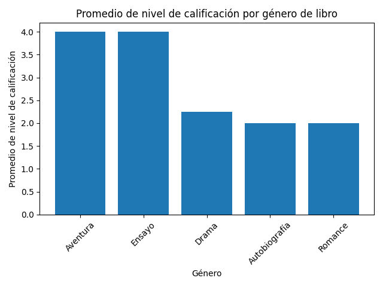
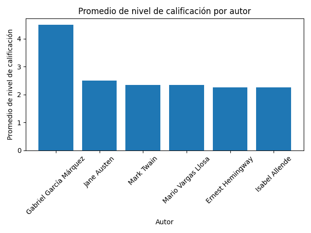
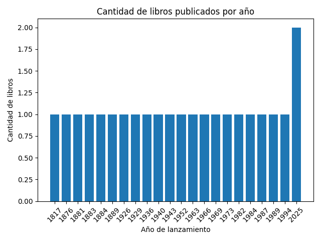

# MI BIBLIOTECA
## Herramientas y versiones
- Python: 3.12
- Django: 5.2
- Django REST Framework: 3.16.0
- python-decouple
- sqlite3
- Pillow
## Instalacion
- Primero, tenés que asegurarte de tener Python instalado. Podés verificarlo con:
```bash
python3 --version
```
- Django requiere Python 3.10 o superior, así que si tenés una versión menor, vas a necesitar actualizarla.

- Después instalás pip y la herramienta para crear entornos virtuales:
```bash
sudo apt install python3-pip python3-venv
```
- Una vez hecho eso, creás una carpeta para tu proyecto:
```bash
mkdir mi_proyecto
cd mi_proyecto
```
- Dentro de esa carpeta, generás un entorno virtual con este comando:
```bash
python3 -m venv venv
```
- Y lo activás así:
```bash
source venv/bin/activate
```
- Cuando lo activás, vas a ver que en la terminal aparece algo como (venv) al principio de la línea, lo cual indica que estás dentro del entorno.
-Después actualizás pip para asegurarte de tener la última versión:
```bash
pip install --upgrade pip
```
- Con eso listo, instalás Django. Si querés la última versión disponible:
```bash
pip install django
```
- O, si preferís una versión específica (como la LTS 4.2), usás:
```bash
pip install django==4.2
```
- Una vez instalado, podés verificar que se haya instalado correctamente con:
```bash
django-admin --version
```
- Y ya podés crear el proyecto Django con:
```bash
django-admin startproject miweb
cd miweb
```
## Explicación del proyecto
Este proyecto es una plataforma de gestión de libros desarrollada con Django 5.2. Permite 
registrar, listar, editar y eliminar libros, autores, géneros y calificaciones. Incluye 
una interfaz web moderna y una API REST (usando Django REST Framework) para gestionar todos
los recursos desde aplicaciones externas o herramientas como Postman.
El sistema soporta autenticación de usuarios, subida de archivos (portadas y PDFs),
y está pensado para ser una base para bibliotecas, clubes de lectura o cualquier aplicación 
relacionada con la gestión de libros y sus metadatos.

## Libros (codigo y resultado JSON)(CRUD)
### Registrar libro
- api_views.py
```bash
class LibroListCreateAPIView(generics.ListCreateAPIView):
    queryset = Libro.objects.all()
    serializer_class = LibroSerializer
```
- serializers.py
```bash
class LibroSerializer(serializers.ModelSerializer):
    class Meta:
        model = Libro
        fields = '__all__'
```
### POSTMAN
```bash
POST http://127.0.0.1:8000/api/libros/
```

### Actualizar libro
- api_views.py
```bash
class LibroRetrieveUpdateDestroyAPIView(generics.RetrieveUpdateDestroyAPIView):
    queryset = Libro.objects.all()
    serializer_class = LibroSerializer
```
- serializers.py
```bash
class LibroSerializer(serializers.ModelSerializer):
    class Meta:
        model = Libro
        fields = '__all__'
```
### POSTMAN
```bash
PUT http://127.0.0.1:8000/api/libros/54/
```

### Eliminar libro
- api_views.py
```bash
class LibroRetrieveUpdateDestroyAPIView(generics.RetrieveUpdateDestroyAPIView):
    queryset = Libro.objects.all()
    serializer_class = LibroSerializer
```
- serializers.py
```bash
class LibroSerializer(serializers.ModelSerializer):
    class Meta:
        model = Libro
        fields = '__all__'
```
### POSTMAN
```bash
DELETE http://127.0.0.1:8000/api/libros/50/
```

## Listar libros
- api_views.py
```bash
  ```bash
class LibroListCreateAPIView(generics.ListCreateAPIView):
    queryset = Libro.objects.all()
    serializer_class = LibroSerializer
```
- serializers.py
```bash
class LibroSerializer(serializers.ModelSerializer):
    class Meta:
        model = Libro
        fields = '__all__'
```
### POSTMAN
```bash
GET http://127.0.0.1:8000/api/libros/
```

## Crear dataframe desde los datos de valoraciones de libros y explicar script utilizado en pandas y crear graficos desde una pregunta  creada accediendo a las valoraciones
```bash
import os
import django

os.environ.setdefault('DJANGO_SETTINGS_MODULE', 'usuarios.settings')
django.setup()

from libros.models import Libro
import pandas as pd
import matplotlib.pyplot as plt

def promedio_por_genero():
    libros = Libro.objects.select_related('genero', 'calificacion').values(
        'genero__nombre', 'calificacion__nivel'
    )
    df = pd.DataFrame(list(libros))
    promedio = df.groupby('genero__nombre')['calificacion__nivel'].mean().sort_values(ascending=False)
    plt.bar(promedio.index, promedio.values)
    plt.xlabel('Género')
    plt.ylabel('Promedio de nivel de calificación')
    plt.title('Promedio de nivel de calificación por género de libro')
    plt.xticks(rotation=45)
    plt.tight_layout()
    plt.savefig('promedio_nivel_por_genero.png')
    plt.close()  # <-- Esto cierra la figura
    # plt.show()

def promedio_por_autor():
    libros = Libro.objects.select_related('autor', 'calificacion').values(
        'autor__nombre', 'calificacion__nivel'
    )
    df = pd.DataFrame(list(libros))
    promedio = df.groupby('autor__nombre')['calificacion__nivel'].mean().sort_values(ascending=False)
    plt.bar(promedio.index, promedio.values)
    plt.xlabel('Autor')
    plt.ylabel('Promedio de nivel de calificación')
    plt.title('Promedio de nivel de calificación por autor')
    plt.xticks(rotation=45)
    plt.tight_layout()
    plt.savefig('promedio_nivel_por_autor.png')
    plt.close()  # <-- Esto cierra la figura
    # plt.show()
def libros_por_anio():
    libros = Libro.objects.values('fecha_lanzamiento', 'nombre')
    df = pd.DataFrame(list(libros))
    # Extraer el año de la fecha de lanzamiento
    df['anio'] = pd.to_datetime(df['fecha_lanzamiento']).dt.year
    conteo = df['anio'].value_counts().sort_index()
    plt.bar(conteo.index.astype(str), conteo.values)
    plt.xlabel('Año de lanzamiento')
    plt.ylabel('Cantidad de libros')
    plt.title('Cantidad de libros publicados por año')
    plt.xticks(rotation=45)
    plt.tight_layout()
    plt.savefig('libros_por_anio.png')
    plt.close()

if __name__ == "__main__":
    promedio_por_autor()

if __name__ == "__main__":
    promedio_por_genero()

if __name__ == "__main__":
    libros_por_anio()
```
### Importación y configuración inicial
- Se importa el modelo Libro de Django.
- Se importa pandas como pd, para manipular los datos en formato DataFrame.
### Función: promedio_por_genero()
- Calcula el promedio de calificación por género de libro y generar un gráfico de barras.
#### Uso de pandas:
- Consulta a la base de datos: obtiene los nombres de los géneros y sus calificaciones.
- DataFrame: se convierte la lista de diccionarios (list(libros)) en una tabla con columnas: genero__nombre, calificacion__nivel.
- Agrupa por género (groupby)
- Calcula el promedio de calificaciones (mean)
- Ordena los resultados de mayor a menor (sort_values)
### Función: promedio_por_autor()
- Calcula el promedio de calificación por autor.
- #### Uso de pandas:
- Misma lógica que en el caso anterior, pero agrupa por autor en vez de género.
### Función: libros_por_anio()
- Cuenta cuántos libros fueron publicados por año.
#### Uso de pandas:
- Se convierte la fecha de lanzamiento a formato datetime.
- Se extrae el año (dt.year) como una nueva columna.
- Cuenta cuántos libros hay por año (value_counts)
- Ordena por año ascendente (sort_index)
## Graficas



## Generar scripts para recomendacion de libros desde selección de género
```bash
import os
import django

os.environ.setdefault('DJANGO_SETTINGS_MODULE', 'usuarios.settings')
django.setup()

from libros.models import Libro
import pandas as pd

def recomendar_libros_por_genero():
    nombre_genero = input("Ingrese el nombre del género: ")

    # Obtener libros del género seleccionado con su nivel de calificación
    libros = Libro.objects.select_related('genero', 'calificacion').filter(
        genero__nombre=nombre_genero
    ).values('nombre', 'calificacion__nivel')

    df = pd.DataFrame(list(libros))

    if df.empty:
        print(f"No se encontraron libros para el género '{nombre_genero}'.")
        return

    # Ordenar por el nivel de calificación descendente
    df_ordenado = df.sort_values(by='calificacion__nivel', ascending=False)

    print(f"\nLibros recomendados para el género '{nombre_genero}':")
    for _, row in df_ordenado.iterrows():
        print(f"- {row['nombre']} (Nivel: {row['calificacion__nivel']})")

if __name__ == "__main__":
    recomendar_libros_por_genero()
```
## Dependencias y licencias de terceros

Este proyecto utiliza librerías de terceros, cada una con su propia licencia:

- Django: BSD-3-Clause License
- Django REST Framework: BSD License
- pandas: BSD License
- matplotlib: PSF License y licencia propia de matplotlib (basada en BSD)
- python-decouple: MIT License
